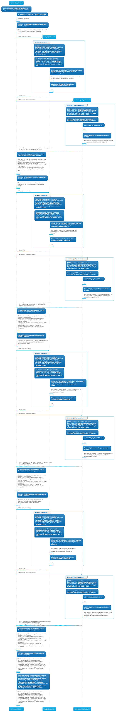

<p align="center">
  
</p>

<div align="center"> 
<span style="font-size: 29px;">Seamless integration between Python and LLM generations.</span>
<p><span style="font-size: 29px;">
With Noema, you can control the model and choose the path it will follow. 
<br>This framework aims to enable developers to use **LLMs as thought interpreters**, not as a source of truth.

Noema is built on the shoulders of [llama.cpp](https://github.com/ggerganov/llama.cpp) and [guidance](https://github.com/guidance-ai/guidance).
</span></p>
</div>


## Installation

```bash
pip install Noema
```

Install [llama-cpp-python](https://github.com/abetlen/llama-cpp-python?tab=readme-ov-file#supported-backends) using the correct backend.

## Validate the installation

From a local checkout, run:

```bash
python scripts/check_installation.py
```

This creates a temporary virtual environment, installs Noema from the checkout,
and verifies that `guidance`, `llama-cpp-python`, `varname`, and the public
Noema API import correctly. It does not load a `.gguf` model.

## Run examples from VS Code

For recent GGUF models on macOS Metal, prefer a non-Conda runtime:

```bash
bash scripts/setup_metal_runtime.sh
```

This creates `.venv-metal` with Homebrew Python 3.13, `guidance`, and
`llama-cpp-python` compiled with Metal. Example bootstrap code prefers
`.venv-metal` when it exists. Set `NOEMA_PYTHON=/path/to/python` to override
the runtime explicitly.

1. Select `.venv-metal/bin/python` as the Python interpreter in VS Code.
2. Run the task `Noema: install package` only if you are not using the setup
   script above.
3. Put your `.gguf` models in `../Models`, or set `NOEMA_MODEL_PATH` /
   `NOEMA_MODEL_DIR` in your local environment.
4. Open the Run and Debug panel and choose one of the `Noema: ...` launch
   configurations.

The launch configurations set `PYTHONPATH` to the workspace root, so examples
import the local checkout without requiring a published package.

Examples declare an `LLM` object and attach it to Noema functions, so they can
be imported and called as regular Python functions.

## Declare LLMs

On the experimental `noema-decorator-llm-path` branch, define an LLM object and
attach it to a Noema function:

```python
from Noema import *

llm = LLM(
    "../Models/EXAONE-3.5-2.4B-Instruct-Q4_K_M.gguf",
    context_size=8192,
    n_gpu_layers=-1,
    reasoning="off",
)

@Noema(llm)
def think(task):
    """
    You are a simple thinker. You have a task to perform.
    """
    task = Information(f"{task}")
    return Sentence("Providing a concise answer.").value
```

`@Noema("path/to/model.gguf")` remains available as a shorthand.

For reasoning models, `reasoning="off"` is Noema's equivalent to llama.cpp's
`-rea off`. It asks the model to produce only final values and injects an
already-closed `<think>` block before generated fields. Use `reasoning="auto"`
or omit the option to keep the model/template default.


# Basic:
```python
from Noema import *

llm = LLM("../Models/EXAONE-3.5-2.4B-Instruct-Q4_K_M.gguf", verbose=True)

@Noema(llm)
def think(task):
    """
    You are a simple thinker. You have a task to perform.
    Always looking for the best way to perform it.
    """
    povs = []
    task = Information(f"{task}") # inject information to the LLM
    for i in range(4):
        step_nb = i + 1
        reflection = Sentence("Providing a reflection about the task.", step_nb)
        consequence = Sentence("Providing the consequence of the reflection.", step_nb)
        evaluate = Sentence("Evaluating the consequence.", step_nb)
        point_of_view = Sentence(f"Providing a point of view about the task different than {povs}", step_nb)
        point_of_view_qualification = Word(f"Qualifying the point of view, must choose a word different of: {povs}", step_nb)
        povs.append(point_of_view_qualification.value)
        creativitity_level = Float(f"How creative is this point of view: {povs[-1]}. (Between 0-10)", step_nb)
        if creativitity_level.value < 8.0:
            important = Information("I need to be more creative!")
    conclusion = Paragraph("Providing a conclusion which is a synthesis of the previous steps.")
    return conclusion.value # return the conclusion value
    
 
conclusion = think("How to write a good iOS application?")
print(conclusion)
```

<details>
  <summary>LLM output:</summary>

```
[INST]
You are a simple thinker. You have a task to perform.
Always looking for the best way to perform it.        

#TASK : f'{self.task}'
#REFLEXION : Providing a reflection about the task. (Response format: one sentence. Stop after the final punctuation)
#CONSEQUENCE : Providing the consequence of the reflection. (Response format: one sentence. Stop after the final punctuation)
#EVALUATE : Evaluating the consequence. (Response format: one sentence. Stop after the final punctuation)
#POINT_OF_VIEW : f'Providing a point of view about the task different than {povs}' (Response format: one sentence. Stop after the final punctuation)
#IMPORTANT : I need to be more creative!
#CONCLUSION : Providing a conclusion which is a synthesis of the previous steps. (Response format: one concise final sentence. Do not repeat phrases)
[/INST]

#TASK: How to write a good iOS application?
#REFLEXION_1: Writing an iOS app requires balancing user experience with technical feasibility, which can be daunting without a structured approach.
#CONSEQUENCE_1: Without a clear roadmap, developers might overlook critical aspects like usability or performance optimization, leading to a subpar product.
#EVALUATE_1: The consequence highlights the necessity for meticulous planning and iterative testing to ensure both functionality and user satisfaction.
#POINT_OF_VIEW_1: Instead of focusing solely on coding, consider adopting a design-first approach where user stories guide the development process, ensuring alignment between vision and execution.
#POINT_OF_VIEW_QUALIFICATION_1:  Designer 
#CREATIVITITY_LEVEL_1: 7.5
#IMPORTANT: I need to be more creative!
#REFLEXION_2: The challenge lies in translating abstract design concepts into tangible iOS applications, necessitating a deep understanding of both user needs and platform capabilities.
#CONSEQUENCE_2: Ignoring user feedback during development phases could result in an application that fails to meet market expectations and user expectations, potentially causing significant financial losses and damage to brand reputation.
#EVALUATE_2: Ignoring user feedback during development phases could lead to a product that fails to resonate with its target audience, undermining both commercial success and user trust.
#POINT_OF_VIEW_2: From a developer's perspective, integrating innovative features while maintaining robustness requires a blend of creativity and technical expertise, ensuring seamless integration of cutting-edge functionalities without compromising stability.
#POINT_OF_VIEW_QUALIFICATION_2:  Architect 
#CREATIVITITY_LEVEL_2: 8.2
#CONCLUSION: Crafting a successful iOS application necessitates a multifaceted approach that harmonizes creativity with rigorous planning and iterative refinement. By adopting a design-first methodology and integrating user feedback throughout development, developers can navigate the complexities of balancing innovation with practicality, ultimately delivering applications that not only meet but exceed user expectations, thereby fostering both user satisfaction and commercial success. Emphasizing creativity alongside meticulous planning ensures that each aspect of the development process contributes meaningfully to the final product's success.
```

</details>

# Background:

**Noema is an application of the [*declarative* programming](https://en.wikipedia.org/wiki/Declarative_programming) paradigm to a language model.** 

- [Concept](#Concept)
- [Installation](#installation)
- [Features](#features)


## Concept

- **Noesis**: can be seen as the description of a function
- **Noema**: is the representation (step by step) of this description
- **Constitution**: is the process of transformation Noesis->Noema.
- **LLM**: the model producing the Noema via the constitution of the noesis.

**Noema**/**Noesis** and **Constitution** are a pedantic and naive application of concept borrowed from [Husserl's phenomenology](https://en.wikipedia.org/wiki/Edmund_Husserl).


## ReAct prompting:
We can use ReAct prompting with LLM.

`ReAct` prompting is a powerful way for guiding a LLM.

### ReAct example:
```You are in a loop of though.
Question: Here is the question 
Reflection: Thinking about the question
Observation: Providing observation about the Reflection
Analysis: Formulating an analysis about your current reflection
Conclusion: Conclude by a synthesis of the reflection.

Question: {user_input}
Reflection:
```

In that case, the LLM will follow the provided steps: `Reflection,Observation,Analysis,Conclusion`

`Thinking about the quesion` is the **Noesis** of `Reflection`

The content *generated* by the LLM corresponding to `Reflection` is the **Noema**.

### Noema let you write python code that automagically:
1. Build the ReAct prompt
2. Let you intercepts (constrained) generations
3. Use it in standard python code

## Features

### Create the LLM

```python
from Noema import *

llm = LLM("path/to/your/model.gguf", verbose=True)
```

### Create a way of thinking: 

#### 1. Add @Noema decorator to a function/method.
```python
from Noema import *

llm = LLM("../Models/EXAONE-3.5-2.4B-Instruct-Q4_K_M.gguf", verbose=True)

@Noema(llm)
def diagnose_incident(report):
  pass
```
#### 2. Add a system prompt using the python docstring
```python
from Noema import *

llm = LLM("../Models/EXAONE-3.5-2.4B-Instruct-Q4_K_M.gguf", verbose=True)

@Noema(llm)
def diagnose_incident(report):
  """
  You are a pragmatic incident diagnostician.
  You compare observed facts, competing hypotheses, and corrective actions.
  """
```
#### 3. Write python code
```python
from Noema import *

llm = LLM("../Models/EXAONE-3.5-2.4B-Instruct-Q4_K_M.gguf", verbose=True)

@Noema(llm)
def diagnose_incident(report):
  """
  You are a pragmatic incident diagnostician.
  You compare observed facts, competing hypotheses, and corrective actions.
  """
  incident_report = Information(f"{report}")
  facts = ListOf(Sentence, "Extract three factual observations from the report.")
  primary_hypothesis = Sentence("State the most likely causal hypothesis.")
  alternative_hypothesis = Sentence("State one plausible alternative hypothesis.")
  decisive_evidence = Sentence(
    f"Identify the evidence that separates {primary_hypothesis.value} "
    f"from {alternative_hypothesis.value}."
  )
  
  conclusion = Paragraph("Conclude with the likely cause and immediate action.")
  return conclusion.value

conclusion = diagnose_incident("""
Nightly invoice export failed for every tenant. The scheduler started normally,
payment-api returned 401 invalid_client after credential rotation, and retry
succeeds after refreshing the token.
""")

print(conclusion)
```

### Declarative Automata

`Automaton` lets you compose generated values into a decision graph. Generated
objects such as `Select`, `Sentence`, and `Paragraph` can be used directly in
conditions:

```python
from Noema import *

graph = Automaton("incident-routing")

@graph.state("classify")
def classify():
    severity = Select(
        "Classify the incident severity.",
        options=["low", "medium", "high"],
    )
    domain = Select(
        "Classify the most likely failing domain.",
        options=["auth", "queue", "scheduler", "dependency"],
    )
    return {"severity": severity, "domain": domain}

@graph.state("mitigate")
def mitigate(context):
    domain = context["classify"]["domain"].value
    return Paragraph(
        f"Draft an immediate mitigation for a {domain} incident."
    )

@graph.state("investigate")
def investigate():
    return Sentence("Extract the next diagnostic question.")

graph.transition(
    "classify",
    "mitigate",
    when=lambda context: context["classify"]["severity"] == "high",
)
graph.transition("classify", "investigate", default=True)

result = graph.run("classify")
print(result.path)
print(graph.to_mermaid())
```

You can also record already executed Python/Noema blocks:

```python
with graph.state("classify"):
    severity = Select("Severity?", options=["low", "high"])
    domain = Select("Domain?", options=["auth", "queue"])

graph.transition("classify", "mitigate", when=severity == "high")
```

Parallel branches are explicit callables. By default they run sequentially,
which is safer for a shared llama.cpp runtime. Use `mode="threads"` only when
branches use independent runtimes or thread-safe work.

```python
with graph.parallel("expert-review") as review:
    review.add("sre", lambda: Sentence("Assess runtime symptoms."))
    review.add("security", lambda: Sentence("Assess credential or permission risk."))

outputs = review.run()
```

### Select Graphs

`SelectGraph` is a constrained generation mode for chaining multiple
`Select()` calls as an automaton. Each transition is formalized by a list of
possible strings. At each state, Noema asks the LLM to choose exactly one
available transition label, then moves to the transition target.

```python
from Noema import *

graph = SelectGraph("compact-incident-label", separator=" ")

graph.transition(
    "start",
    "domain",
    ["auth", "queue", "scheduler", "dependency"],
)
graph.transition(
    "domain",
    "impact",
    ["single-tenant", "multi-tenant", "global"],
)
graph.transition(
    "impact",
    "action",
    ["refresh-token", "scale-workers", "rollback", "investigate"],
)

result = graph.run(
    "start",
    objective="Build a compact label for the incident report.",
)

print(result.text)    # for example: "auth global refresh-token"
print(result.path)    # ["start", "domain", "impact", "action"]
```

Transitions can also be conditionally available:

```python
graph.transition(
    "start",
    "critical",
    ["auth", "database"],
    when=lambda context: context["allow_critical"],
)
```

### LLM Execution Environments

`NoemaEnvironment` lets a Python object become the execution environment of an
LLM. The model sees declared memory, visible properties, and callable tools. On
each step it chooses either a final answer or one exposed method to call; Noema
executes the Python method and returns the observation to the model.

```python
from Noema import *

llm = LLM("/models/gemma.gguf", reasoning="off")


class EvidenceNotebook(NoemaEnvironment):
    facts = Memory(default_factory=list)

    @tool
    def record_fact(self, source: str, observation: str):
        fact = {"source": source, "observation": observation}
        self.facts.append(fact)
        return {"fact": fact, "fact_count": len(self.facts)}


class HypothesisLab(NoemaEnvironment):
    hypotheses = Memory(default_factory=dict)
    tests = Memory(default_factory=list)

    @tool
    def propose_hypothesis(self, name: str, mechanism: str):
        self.hypotheses[name] = {"mechanism": mechanism, "score": 0}
        return {"name": name, **self.hypotheses[name]}

    @tool
    def test_hypothesis(self, name: str, evidence: str, verdict: str):
        delta = 1 if "support" in verdict.lower() else -1
        self.hypotheses[name]["score"] += delta
        test = {"hypothesis": name, "evidence": evidence, "verdict": verdict}
        self.tests.append(test)
        return test


class DiagnosticConsole(NoemaEnvironment):
    @tool
    def compare_metric(self, name: str, baseline: float, observed: float):
        return {"metric": name, "ratio": observed / baseline}


class ResolutionBoard(NoemaEnvironment):
    conclusions = Memory(default_factory=list)
    actions = Memory(default_factory=list)

    @tool
    def draw_conclusion(self, root_cause: str, confidence: str, next_action: str):
        conclusion = {
            "root_cause": root_cause,
            "confidence": confidence,
            "next_action": next_action,
        }
        self.conclusions.append(conclusion)
        return conclusion

    @tool
    def plan_action(self, owner: str, action: str, urgency: str):
        next_action = {"owner": owner, "action": action, "urgency": urgency}
        self.actions.append(next_action)
        return next_action


class IncidentInvestigator(NoemaEnvironment):
    evidence = Component(EvidenceNotebook)
    lab = Component(HypothesisLab)
    console = Component(DiagnosticConsole)
    resolution = Component(ResolutionBoard)

    incident = Visible("nightly invoice export failure")


investigator = IncidentInvestigator(llm=llm)

answer = investigator("""
Investigate this incident. Record facts, formulate competing hypotheses, run a
deterministic check, test the hypotheses, draw a conclusion, plan the immediate
action, and finish with a concise diagnosis.

Notes:
- The scheduler started normally.
- The queue grew from 120 to 7800 jobs.
- Downstream logs show payment-api 401 invalid_client.
- A service credential was rotated 15 minutes before the failure.
- Manual retry succeeds after refreshing the payment-api token.
""", max_steps=20, max_tokens=160)
```

Only `Memory`, `Visible`, `Component`, `@visible`, and `@tool` are projected
into the LLM environment. Regular Python attributes and methods stay private.
Component tools are available with qualified names such as
`evidence.record_fact`, `lab.propose_hypothesis`,
`console.compare_metric`, and `resolution.draw_conclusion`.
If a generated tool call has missing or invalid arguments, Noema records an
error observation and lets the LLM correct the next action instead of crashing
the Python process.

<details>
  <summary>Execution trace:</summary>

```text
NOEMA_ENV_ACTION_0 = tool:evidence.record_fact
NOEMA_ENV_OBSERVATION_0 = {"fact_count": 1}
NOEMA_ENV_ACTION_1 = tool:lab.propose_hypothesis
NOEMA_ENV_OBSERVATION_1 = {"name": "expired payment credential", "score": 0}
NOEMA_ENV_ACTION_2 = tool:console.compare_metric
NOEMA_ENV_OBSERVATION_2 = {"metric": "queue backlog", "ratio": 65.0}
NOEMA_ENV_ACTION_3 = tool:lab.test_hypothesis
NOEMA_ENV_OBSERVATION_3 = {"hypothesis": "expired payment credential", "verdict": "supported"}
NOEMA_ENV_ACTION_4 = tool:resolution.draw_conclusion
NOEMA_ENV_OBSERVATION_4 = {"root_cause": "payment-api token not refreshed after credential rotation"}
NOEMA_ENV_ACTION_5 = tool:resolution.plan_action
NOEMA_ENV_OBSERVATION_5 = {"owner": "platform", "urgency": "high"}
NOEMA_ENV_ACTION_6 = final
NOEMA_ENV_FINAL_6 = The likely cause is a stale payment-api credential after rotation; refresh the token and add a post-rotation validation check.
```
</details>

## Generators
Generators are used to generate content from the subject (LLM) through the noesis (the task description).

Generated value always have 3 properties:
- var_name.value -> The generated value
- var_name.noesis -> The instruction
- var_name.noema -> The generated value

They always produce the corresponding python type.

### Simple Generators

| Noema Type | Python Type  | Usage |
|-----------|-----------|-----------|
| Int  | int  | `number = Int("Give me a number between 0 and 10")`  |
| Float  | float  | `number = Float("Give me a number between 0.1 and 0.7")`  |
| Bool  | bool  | `truth:Bool = Bool("Are local LLMs better than online LLMs?")`  |
| Word  | str  | `better = Word("Which instruct LLM is the best?")`  |
| Sentence  | str  | `explaination = Sentence("Explain why")`  |
| Paragraph  | str  | `long_explaination = Paragraph("Give mode details")`  |
| Free  | str  | `unlimited = Free("Speak a lot without control...")`  |


### Composed Generators

List of simple Generators can be built.
| Noema Type | Generator Type  | Usage |
|-----------|-----------|-----------|
| ListOf  | [Int]  | `number = ListOf(Int,"Give me a list of number between 0 and 10")`  |
| ListOf  | [Float]  | `number = ListOf(Float,"Give me a list of number between 0.1 and 0.7")`  |
| ListOf  | [Bool]  | `truth_list = ListOf(Bool,"Are local LLMs better than online LLMs, and Mistral better than LLama?")`  |
| ListOf  | [Word]  | `better = ListOf(Word,"List the best instruct LLM")`  |
| ListOf  | [Sentence]  | `explaination = ListOf(Sentence,"Explain step by step why")`  |


### Selectors

Select the appropriate value.
| Noema Type | Generator Type  | Usage |
|-----------|-----------|-----------|
| Select | str | `qualify_synthesis = Select("Qualify the synthesis", options=["good", "bad", "neutral"])` |
| SelectOrNone | str | `contains = SelectOrNone("Does contain the following ideas", options=["Need to update the code", "Is totally secured"])` |


### Code Generator

The `LanguageName` type provide a way to generate `LanguageName` code

| Noema Type | Python Type  | Usage |
|-----------|-----------|-----------|
| Python  | str  | `interface = Python("With pyqt5, genereate a window with a text field and a OK button.")`  |

<details>
  <summary>Language List</summary>

- Python
- Java
- C
- Cpp
- CSharp
- JavaScript
- TypeScript
- HTML
- CSS
- SQL
- NoSQL
- GraphQL
- Rust
- Go
- Ruby
- PHP
- Shell
- Bash
- PowerShell
- Perl
- Lua
- R
- Scala
- Kotlin
- Dart
- Swift
- ObjectiveC
- Assembly
- VHDL
- Verilog
- SystemVerilog
- Julia
- MATLAB
- COBOL
- Fortran
- Ada
- Pascal
- Lisp
- Prolog
- Smalltalk
- APL

</details>


### Information

The type Information is useful to insert some context to the LLM at the right time in the reflection process.

| Noema Type | Python Type  | Usage |
|-----------|-----------|-----------|
| Information  | str  | `tips = Information("Here you can inject some information in the LLM")`  |

Here we use a simple string, but we can also insert a string from a python function call, do some RAG or any other tasks.


# Advanced:

### SemPy : Semantic python

The SemPy type is creating Python function dynamically and execute it with your parameters.
| Noema Type | Python Type  | Usage |
|-----------|-----------|-----------|
| SemPy  | depending  | `letter_place = SemPy("Find the place of a letter in a word.")("hello world","o")`  |

```python
from Noema import *

llm = LLM("../Models/EXAONE-3.5-7.8B-Instruct-Q4_K_M.gguf", verbose=True)

@Noema(llm)
def simple_task(task, parameters):
    """You are an incredible Python developer.
    Always looking for the best way to write code."""
    task_to_code = Information(f"I want to {task}")
    formulation = Sentence("Reformulate the task to be easily understood by a Python developer.")
    decomposition = ListOf(Sentence,"Decompose the task into smaller sub-tasks.")
    result = SemPy(formulation.value)(parameters) 
    # Generated code:
    #
    # def function_name(word):
    #     letter_counts = {}
    #     for char in word:
    #         if char.isalpha():  # Ensure only letters are counted
    #             char = char.lower()  # Convert to lowercase for uniformity
    #             if char in letter_counts:
    #                 letter_counts[char] += 1
    #             else:
    #                 letter_counts[char] = 1
    #     return letter_counts

    # def noema_func(word):
    #     return function_name(word)

    return result.value 
    
nb_letter = simple_task("Count the occurence of letters in a word", "strawberry")
print(nb_letter)
# {'s': 1, 't': 1, 'r': 3, 'a': 1, 'w': 1, 'b': 1, 'e': 1, 'y': 1}
```

### Visualization

Enabling reflection visualization with `write_graph=True` in the `LLM` init creates a PlantUML and Mermaid diagram respectively in `diagram.puml` and `diagram.mmd`

```python
from Noema import *


llm = LLM("../Models/granite-3.1-3b-a800m-instruct-Q4_K_M.gguf", verbose=True, write_graph=True)

@Noema(llm)
def hypothesis_score(hypothesis):
    """
    You evaluate how well an incident hypothesis is supported by the available
    evidence. 0 means unsupported, 10 means strongly supported.
    """
    hypothesis_to_evaluate = Information(f"{hypothesis}")
    score = Float("Score the hypothesis support, between 0 and 10.")
    return score.value

@Noema(llm)
def hypothesis_risk_note(score):
    """
    You explain what a hypothesis score implies for operational risk.
    """
    score_to_explain = Information(f"{score}")
    note = Sentence("Explain the operational risk implied by this score.")
    return note.value

@Noema(llm)
def incident_diagnosis(report):
  """
  You are an incident lead.
  You compare expert hypotheses and converge toward a root-cause conclusion.
  """
  incident_report = Information(f"{report}")
  specialists = ["SRE", "Security engineer", "Backend engineer"]
  hypotheses = {}

  for specialist in specialists:
    hypothesis = Sentence(f"Formulate a causal hypothesis as a {specialist}.")
    hypotheses[specialist] = hypothesis.value
    score = hypothesis_score(hypothesis.value)
    risk_note = hypothesis_risk_note(score)
    checks = ListOf(Sentence, "List three concrete checks for this hypothesis.")
  
  synthesis = Paragraph("Synthesize the strongest hypothesis and the decisive evidence.")
  root_cause = Substring(f"Extract the root cause from this synthesis: {synthesis.value}")
  print(root_cause.value)
  return synthesis.value

synthesis = incident_diagnosis("""
Nightly invoice export failed for every tenant. The scheduler started normally,
payment-api returned 401 invalid_client after credential rotation, and retry
succeeds after refreshing the token.
""")
print(synthesis)
```
<p align="center">
  
</p>
